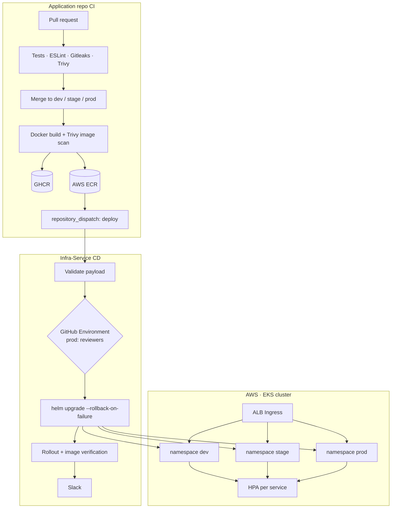

# Expert Listing – Infra-Service

The single home for Expert Listing infrastructure and continuous delivery.

| Owned here | Not here |
|---|---|
| Terraform (AWS: VPC, EKS, ECR, IAM/OIDC, CloudWatch) | Application source code |
| Helm chart and per-environment values | Tests, linting, security scanning |
| Kubernetes Deployments, Services, Ingress, HPA | Docker image builds (done by each app repo's CI) |
| CD workflow for dev / stage / prod | |

Application repositories (`Expert-Listing-Frontend-Service`, `Expert-Listing-Backend-Server-Service`, `Expert-Listing-Geo-Bucket`) build and publish an immutable image tagged with the git SHA, then ask this repo to deploy it. They never touch the cluster.

## Architecture



## Layout

```
.github/workflows/cd.yml     deployment workflow
terraform/                   one root module for all AWS infrastructure
helm/expert-listing/         one chart: a Deployment, Service and HPA file per service, plus one Ingress
  values.yaml                service defaults (ports, probes, resources, ECR repo names)
  values-{dev,stage,prod}.yaml   environment overrides (HPA range, resources, log level)
```

## Terraform

One root module in `terraform/` provisions:

- **VPC** across 3 AZs, with public subnets for the ALB and private subnets for nodes, and a single NAT gateway to keep cost down (use one per AZ for full production HA).
- **EKS** (`terraform-aws-modules/eks`) with a managed node group (c7i-flex.large, 2–4 nodes), control-plane API/audit/authenticator logs, and add-ons: VPC CNI, CoreDNS, kube-proxy, Pod Identity agent, **metrics-server** (needed by HPA) and **Amazon CloudWatch Observability** (Container Insights metrics and container logs).
- **AWS Load Balancer Controller** (Helm release + Pod Identity role), which turns the chart's Ingress into an ALB.
- **Namespaces** `dev`, `stage` and `prod`.
- **ECR** repositories `expert-listing/{frontend,backend,geo-bucket}` with **immutable tags**, scan-on-push and a lifecycle policy that keeps the last 50 images for rollback.
- **GitHub OIDC** provider and two kinds of roles, with no long-lived AWS keys anywhere:

| Role | Trusted by (OIDC `sub`) | Can do |
|---|---|---|
| `expert-listing-ci-<service>` | `repo:Experts-Listing/<app-repo>:ref:refs/heads/{dev,stage,prod}` | Push to **its own** ECR repository only |
| `expert-listing-cd` | `repo:Experts-Listing/Infra-Service:environment:{dev,stage,prod}` | `eks:DescribeCluster`, `ecr:DescribeImages`, plus an EKS access entry with `AmazonEKSEditPolicy` scoped to the `dev`/`stage`/`prod` namespaces only (not cluster admin) |

Pull requests can't assume the CI roles, and only jobs running in a GitHub Environment of this repo can assume the CD role.

- **CloudWatch alarms** (node CPU > 80%, node memory > 80%, failed nodes) go to an SNS topic. Set `alarm_email` to subscribe.

### Apply

Run it once, manually, with admin AWS credentials:

```bash
aws s3api create-bucket --bucket expert-listing-tfstate-<account-id> --region us-east-1
aws s3api put-bucket-versioning --bucket expert-listing-tfstate-<account-id> --versioning-configuration Status=Enabled

cd terraform
cp backend.hcl.example backend.hcl        # set bucket + region
terraform init -backend-config=backend.hcl
terraform plan
terraform apply
terraform output
```

State is stored in S3 with native lockfile locking (`use_lockfile`). The applying identity becomes EKS cluster admin through `enable_cluster_creator_admin_permissions`.

## Helm

`helm/expert-listing` is one chart installed as **one release per environment** (release `expert-listing` in namespace `dev`, `stage` or `prod`). Each service has its own manifests:

```
templates/
  frontend-deployment.yaml   frontend-service.yaml   frontend-hpa.yaml
  backend-deployment.yaml    backend-service.yaml    backend-hpa.yaml
  geo-bucket-deployment.yaml geo-bucket-service.yaml geo-bucket-hpa.yaml
  ingress.yaml               /api/experts → backend, /api/geo → geo-bucket, / → frontend
```

- **Immutable images only.** A service is rendered only when `<service>.image.tag` is set, the chart has no default tag, `latest` is rejected, and `global.imageRegistry` is required. CD supplies all of these.
- **Traceability.** Each pod carries `app.kubernetes.io/version=<sha>`, plus `expert-listing/git-commit` and `expert-listing/source-repository` annotations.
- **Hardened pods.** Non-root, seccomp `RuntimeDefault`, no privilege escalation, all capabilities dropped, read-only root filesystem (writable `/tmp` via `emptyDir`), and no service-account token mounted.
- **Probes.** Startup, liveness (`/healthz`) and readiness (`/readyz` for the APIs, `/healthz` for the frontend).
- **Secrets.** No secret values live in this repo. Set `<service>.existingSecret` to the name of a Kubernetes Secret created out-of-band (for example, synced from AWS Secrets Manager by External Secrets Operator) and it is mounted with `envFrom`.

### HPA

`autoscaling/v2`, scaling on CPU (70%) and memory (80%) against the container requests. metrics-server comes from Terraform.

| Environment | min | max | Requests (API services) |
|---|---|---|---|
| dev | 1 | 2 | 50m CPU / 96Mi |
| stage | 2 | 4 | 50m CPU / 96Mi |
| prod | 3 | 8 | 100m CPU / 128Mi |

HPA scales pods within the node group's capacity. Add Cluster Autoscaler or Karpenter when node-level scaling is needed.

## CD workflow

`.github/workflows/cd.yml` runs on:

- `repository_dispatch` (`event_type: deploy`), sent by an application repo's CI after it has published an image.
- `workflow_dispatch` (service, environment, SHA), used for manual redeploys and rollbacks.

Payload sent by application CI:

```json
{
  "service": "backend",
  "environment": "dev",
  "registry": "<account-id>.dkr.ecr.<region>.amazonaws.com",
  "repository": "expert-listing/backend",
  "tag": "<git-sha>",
  "commit": "<git-sha>",
  "source_repository": "Experts-Listing/Expert-Listing-Backend-Server-Service",
  "source_run_url": "https://github.com/..."
}
```

Steps:

1. **Validate**:
   - `service` and `environment` must be in the allowlist, and `tag` must be a full 40-character SHA equal to `commit`.
   - `source_repository` must be the repo that owns the service.
   - The ECR repository is derived here, not trusted from the payload.
2. **Approve**: the job runs in the GitHub Environment named after the target (`dev`/`stage`/`prod`), so `prod` waits for its required reviewers.
3. **Authenticate**: OIDC into `expert-listing-cd`, then `aws eks update-kubeconfig`.
4. **Check the image**: it must already exist in ECR (`describe-images`).
5. **Deploy**:
   - Run `helm upgrade --install expert-listing` in the env namespace with `values-<env>.yaml`, the new SHA for the target service, and the **currently running SHAs** of the other services (read with `helm get values`), so only one service changes.
   - Flags: `--rollback-on-failure --wait --timeout 10m`, keeping the last 15 revisions.
6. **Verify**:
   - `kubectl rollout status`.
   - The Deployment must run exactly `<registry>/<repo>:<sha>`.
   - All replicas must be updated and available.

   Helm returning success is not enough on its own.
7. **Report**:
   - The job summary shows new image, previous image, commit, Helm revision and source run.
   - On failure it also dumps describe output, events, pod logs and Helm history.
   - Slack gets a message when a deploy is requested, succeeds, fails (auto-rolled back), is rejected or is cancelled.

Deploys to the same environment are serialized (`concurrency: deploy-<env>`), and nothing in progress is cancelled.

## Promotion

```
feature/* ──PR──▶ dev ──PR──▶ stage ──PR──▶ prod        (application repos)
                   │            │            │
                   ▼            ▼            ▼
                dev ns      stage ns      prod ns      (deployed by this repo)
```

Merging into an app repo's `dev`, `stage` or `prod` branch deploys to the environment of the same name. A fast-forward promotion reuses the exact image already in ECR, because tags are immutable and CI skips re-pushing an existing SHA.

## Rollback

Every image is kept in ECR under its git SHA, so a rollback never rebuilds anything.

- **Preferred:** Actions → CD → *Run workflow*, choose the service and environment, and enter the previous SHA. It goes through the same validation, approval and verification as any deploy. The previous image is listed in the last deploy's job summary and Slack message.
- **Break-glass:** revert the whole environment release to an earlier revision.
  ```bash
  helm history expert-listing -n prod        # the description column shows <service>=<sha>
  helm rollback expert-listing <revision> -n prod --wait
  ```
- **Automatic:** a deploy that fails to become healthy is rolled back by `--rollback-on-failure`.

To see what's running: `kubectl get deploy -n <env> -L app.kubernetes.io/version`.

## Observability

- **Logs:** apps log JSON to stdout, and Container Insights ships them to CloudWatch Logs (`/aws/containerinsights/expert-listing/application`). EKS control-plane logs go to `/aws/eks/expert-listing/cluster`.
- **Metrics:** Container Insights provides node, pod and container CPU/memory. `kubectl top` and `kubectl get hpa` work through metrics-server.
- **Deployment status:** GitHub Environments show deployment history per environment, and Slack reports every deploy.
- **Alerts:** CloudWatch alarms on node CPU, node memory and failed nodes go to SNS.

## Security scan status

`trivy config` over `helm/` reports no HIGH or CRITICAL findings. For `terraform/`, these HIGH/CRITICAL findings are accepted on purpose:

| Finding | Why it is accepted | How to tighten |
|---|---|---|
| AWS-0040/0041: EKS API endpoint is public (`0.0.0.0/0`) | GitHub-hosted runners have no fixed IPs and must reach the API. Access still requires IAM auth plus an EKS access entry. | Set `cluster_endpoint_public_access_cidrs`, or run CD on self-hosted runners inside the VPC and disable the public endpoint. |
| AWS-0104: node security group allows all egress | Nodes must pull images and reach AWS APIs through the NAT gateway. This is the upstream EKS module default. | Add VPC endpoints (ECR, S3, STS, CloudWatch) and restrict egress. |
| AWS-0095: SNS alarm topic not KMS-encrypted | CloudWatch alarms can't publish to topics encrypted with the AWS-managed `aws/sns` key, and the alarms carry no sensitive data. | Add a customer-managed KMS key whose policy allows `cloudwatch.amazonaws.com`. |

## Required configuration

**Infra-Service → Settings → Environments:** create `dev`, `stage` and `prod`. For `prod`, add required reviewers and allow deployments from the `main` branch only.

| Kind | Name | Value |
|---|---|---|
| Variable | `AWS_REGION` | `terraform output aws_region` |
| Variable | `EKS_CLUSTER_NAME` | `terraform output eks_cluster_name` |
| Variable | `AWS_CD_ROLE_ARN` | `terraform output cd_role_arn` |
| Secret | `SLACK_WEBHOOK_URL` | Slack incoming webhook (org secret; notifications are skipped if unset) |

**Application repositories:**

- `INFRA_DISPATCH_TOKEN` (secret): a fine-grained token limited to `Infra-Service` with **Contents: Read and write**, which `repository_dispatch` requires.
- In each app repo, set `AWS_REGION` and `AWS_ECR_PUSH_ROLE_ARN` from `terraform output ci_push_role_arns`.

**Branch protection (recommended):** protect `main` here (PR plus review), and protect `dev`, `stage` and `prod` in the app repos (PR plus required CI checks, no force-push).
